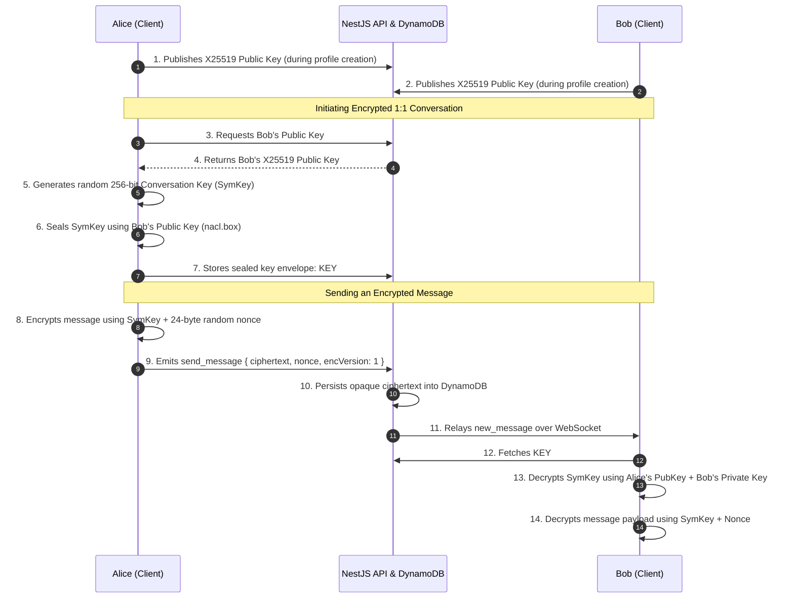

# Nexus — Distributed Real-Time Communication & AI Platform
## System Architecture, Design Specification & Requirements Document

---

# [PAGE 1] Executive Summary, Motivation & Technology Stack

## 1. What It Does ("What It Do")
**Nexus** is a distributed, zero-knowledge real-time communication platform engineered for web environments. It combines military-grade end-to-end encryption (E2EE), high-concurrency messaging, peer-to-peer VoIP/video conferencing, ephemeral ghost messaging, and streaming in-chat AI assistance into a unified, cloud-native architecture.

### Core Capabilities:
1. **1:1 & Group Messaging (Scalable to 1,024 Members):**
   - Instant bi-directional messaging with sub-15 ms p95 delivery latency.
   - Rich interaction states: live typing indicators, emoji reactions, quoted replies, cursor-based pagination, and delivery/read receipts (`sent` $\rightarrow$ `delivered` $\rightarrow$ `read`).
   - Strict cryptographic fan-out cap at 1,024 members per group to preserve client-side decryption performance and database throughput.
2. **Zero-Knowledge Dual-Layer E2EE:**
   - **Symmetric Layer:** NaCl secretbox (`XSalsa20-Poly1305`, 256-bit keys) with 24-byte cryptographically random nonces. Servers process and persist opaque ciphertext only; notification payloads are redacted (`🔒 Encrypted message`).
   - **Asymmetric Key Exchange:** `X25519` keypair distribution (`nacl.box`) enables transparent, automatic in-app key exchange between verified users without requiring manual out-of-band link sharing.
3. **Ghost Chats (Zero-Trace Ephemeral Communication):**
   - Single-use, 5-minute cryptographic invite links (`INVITE#<token>`).
   - **Zero-Registration Guest Access:** Unregistered participants can join via anonymous sessions (`Guest_XXXX`), exchanging conversation keys exclusively through the URL hash fragment (`#k=<keyB64>`), which by RFC 3986 §3.5 is never transmitted to the server.
   - Synchronized 30-second self-destruct timers upon message viewing, backed by native DynamoDB TTL eviction.
4. **WebRTC Mesh Audio/Video Conferencing:**
   - Peer-to-peer VoIP and video calling powered by browser `RTCPeerConnection`, STUN/TURN (COTURN) fallback relays, screen-sharing track replacement (`replaceTrack`), and ICE candidate buffering.
   - Enforces a 5-peer capacity ceiling (1 host + 4 peers) to avoid client CPU throttling and uplink bandwidth saturation on consumer connections.
5. **Streaming In-Chat AI Assistant ("Nexus AI"):**
   - Natural language assistant triggered via `@nexus` or `@ai` mentions.
   - Leverages Groq LLaMA-3 (sub-200 ms TTFT) and Amazon Bedrock with real-time token streaming, automated speech-to-text voice note transcription, and language translation via Amazon Translate.
6. **Adaptive Network Quality Engine:**
   - Real-time client telemetry monitoring packet round-trip time (`network_ping`), online/offline transitions, and network speed APIs (`navigator.connection`) to surface dynamic warning banners during network degradation.

---

## 2. Why Do It ("Why Do It")
Modern team and personal communication systems face critical structural flaws:

1. **The Server-Side Privacy Illusion:**
   Most commercial messaging tools (Slack, Teams, Discord, Telegram standard chats) retain access to unencrypted message data at rest and in transit. Even platforms claiming privacy often store centralized decryption keys, leaving users vulnerable to insider threats, subpoena leaks, and database breaches. Nexus implements **strict zero-knowledge architecture**: the server cannot read messages even under a total database compromise.
2. **The Ephemeral Gap in Mainstream Apps:**
   "Disappearing messages" on platforms like WhatsApp or Signal still require full phone-number identity verification, persist contact graphs on central servers, and leave forensic metadata. Nexus Ghost Chats provide truly anonymous, single-use, unlinked temporary communication where no accounts exist and keys never touch a server.
3. **The Distributed WebSocket Scaling Bottleneck:**
   Real-time chat backends often suffer from naive stateful socket architectures that cannot scale horizontally across pods. Nexus solves this by decoupling stateless Fastify WebSocket nodes from stateful persistence using a multi-AZ Redis Pub/Sub cluster and single-table DynamoDB.
4. **AI Integration Without Sacrificing E2EE:**
   Most AI-enabled chat platforms feed all conversation streams directly to third-party LLMs. Nexus strictly maintains an **AI Plaintext Boundary**: messages are 100% end-to-end encrypted by default, and only explicit `@nexus` prompts are decrypted client-side and routed to the inference engine.

---

## 3. Technology Stack & Architectural Rationale

| Layer | Technologies Selected | Technical Rationale & Architectural Justification |
| :--- | :--- | :--- |
| **Frontend Framework** | **Next.js 14 (App Router) + React 18.3 + TypeScript** | Enables fast server-side rendering for landing pages, strict type safety across cryptographic objects, and client-side single-page reactivity for the core workspace shell. |
| **Styling & UI** | **Tailwind CSS 3.4 + HeroUI (`@heroui/react`) + Framer Motion** | Delivers a responsive dark-mode design system with accessible components, smooth hardware-accelerated animations, and zero runtime CSS overhead. |
| **Client State** | **Zustand 5.0** | Lightweight, boilerplate-free state management with selective re-renders and seamless hydration for user profiles, active call states, and message streams. |
| **Cryptography** | **TweetNaCl.js (`tweetnacl` 1.0 + `tweetnacl-util`)** | Audited, constant-time pure JavaScript port of DJB's NaCl library. Implements `XSalsa20-Poly1305` authenticated encryption and `X25519` Diffie-Hellman key exchange without external native dependencies. |
| **Backend Engine** | **NestJS 11 + Fastify Platform (`@nestjs/platform-fastify`)** | Fastify offers 2x–3x higher request throughput and significantly lower memory consumption than Express, while NestJS provides modular dependency injection and strict service boundaries. |
| **Real-Time Sync** | **Socket.IO 4.8 + `@socket.io/redis-adapter`** | Provides reliable WebSocket transport with automatic HTTP long-polling fallback, heartbeat recovery, and cross-pod message synchronization via Redis Pub/Sub. |
| **Database** | **Amazon DynamoDB (Single-Table Design)** | Provides predictable single-digit millisecond latency at any concurrency scale, zero maintenance, native TTL automatic data purging, and on-demand autoscaling. |
| **Caching & Pub/Sub**| **Amazon ElastiCache for Redis 7.1 (Multi-AZ)** | Sub-millisecond distributed message broker coordinating WebSocket room broadcasts across multi-node Kubernetes pods. |
| **Object Storage** | **Amazon S3 + CloudFront CDN (OAC)** | Offloads heavy media uploads from API servers using client-direct presigned PUT URLs, protected by AWS Origin Access Control. |
| **Authentication** | **AWS Cognito User Pools + `aws-jwt-verify`** | Secure Remote Password (SRP) authentication, automated token rotation, and zero plain-text password handling on application servers. |
| **Container Cluster** | **Kubernetes (K3s v1.36.4 on AWS EC2)** | **K3s** (CNCF-certified lightweight Kubernetes by SUSE/Rancher). Packaged as a single <512MB RAM binary vs heavy upstream K8s (2-4GB RAM overhead), maximizing available memory on EC2 nodes for high-concurrency WebSocket connections and Fastify pods. |
| **VoIP / Media Relay**| **COTURN (STUN / TURN Pods)** | Live in-cluster VoIP media relay (`3478/udp`, `49152-65535/udp`) guaranteeing WebRTC P2P audio/video connectivity through symmetric NATs and enterprise firewalls (capped at 5 peers). |
| **Ingress & Canary** | **AWS ALB & K3s Traefik Ingress** | Dual-mode ingress: live K3s Traefik ingress on EC2 ports 80/443/8080/3000, with AWS ALB Layer-7 specification supporting sticky sessions (`86400s`), 3600s idle WebSocket timeouts, and automated 10% canary traffic splits (`31-canary-ingress.yaml`). |
| **CI/CD Automation** | **Jenkins + Docker + Terraform** | Multi-stage pipeline automating unit/cryptographic tests, Playwright E2E browser tests, Docker multi-arch builds, and automated canary rollbacks. |


---

# [PAGE 2] System Architecture, API Design & Data Modeling

## 1. High-Level Architecture & Trust Boundaries

```mermaid
flowchart TD
    subgraph ClientLayer ["Client Browser (Zero-Knowledge Zone)"]
        UI["Next.js 14 UI\n(HeroUI + Zustand)"]
        Crypto["TweetNaCl Engine\n(XSalsa20 / X25519)"]
        WebRTC["WebRTC Mesh Manager\n(Audio / Video / Screen)"]
        UI <--> Crypto
        UI <--> WebRTC
    end

    subgraph EdgeLayer ["Edge & Ingress (AWS VPC)"]
        CF["Amazon CloudFront CDN\n(Origin Access Control)"]
        ALB["Application Load Balancer\n(TLS Termination + Canary Routing)"]
    end

    subgraph ClusterLayer ["Compute Layer (Kubernetes Multi-Pod)"]
        FastifyPod1["NestJS Fastify API\n(Pod 1)"]
        FastifyPod2["NestJS Fastify API\n(Pod 2)"]
        CoturnRelay["Coturn STUN / TURN Pod\n(NAT Traversal)"]
    end

    subgraph StateLayer ["Persistence & Messaging"]
        ElastiCache[("Amazon ElastiCache\nRedis 7.1 Cluster (Pub/Sub)")]
        DynamoDB[("Amazon DynamoDB\n(Single-Table NexusTable)")]
        S3Bucket[("Amazon S3 Bucket\n(Encrypted Media)")]
    end

    subgraph IntelligenceLayer ["AI & Managed Services"]
        Groq["Groq LLaMA-3\n(Sub-200ms TTFT)"]
        Translate["Amazon Translate\n(Real-time In-Chat)"]
        Cognito["AWS Cognito\n(User Directory & JWT)"]
    end

    UI -->|HTTPS / WSS| ALB
    UI -->|Direct Upload (Presigned)| S3Bucket
    UI -->|Media Fetch| CF
    CF --> S3Bucket
    WebRTC <-.->|P2P Streams / Relay| CoturnRelay

    ALB --> FastifyPod1
    ALB --> FastifyPod2

    FastifyPod1 <-->|Socket.IO Adapter| ElastiCache
    FastifyPod2 <-->|Socket.IO Adapter| ElastiCache

    FastifyPod1 --> DynamoDB
    FastifyPod2 --> DynamoDB
    FastifyPod1 --> Cognito
    FastifyPod1 --> Groq
    FastifyPod1 --> Translate
```

---

## 2. API Design & Why It Is Structured This Way
Nexus separates **REST APIs** from **WebSocket Events** based on operational idempotency:
- **REST APIs (`Fastify`)**: Dedicated to stateless, idempotent operations: authentication, user profile queries, conversation creation, cursor-based message history retrieval, presigned upload URL generation, and on-demand AI tasks.
- **WebSocket Gateways (`Socket.IO`)**: Dedicated to real-time, low-latency, bidirectional state updates: instant message delivery, live typing signals, reaction toggling, WebRTC call signaling, and self-destruct timers.

### REST API Route Table
| Endpoint | Method | Access Guard | Functionality & Payload Summary |
| :--- | :---: | :--- | :--- |
| `/api/auth/signup` | `POST` | Public | Registers email & password directly with AWS Cognito. |
| `/api/auth/login` | `POST` | Public | Returns Cognito JWT tokens (`idToken`, `refreshToken`) and session cookie. |
| `/api/auth/me` | `GET` | `CognitoAuthGuard` | Returns user profile, username, and public `x25519PublicKey`. |
| `/api/auth/search` | `GET` | `CognitoAuthGuard` | Prefix search across users by username or email for starting chats. |
| `/api/chat/conversations` | `GET` | `CognitoAuthGuard` | Retrieves active user conversations with denormalized previews and unread counts. |
| `/api/chat/conversations` | `POST` | `CognitoAuthGuard` | Initializes direct or group chat; enforces the **1,024 member ceiling**. |
| `/api/chat/messages/:id` | `GET` | `MemberGuard` | Cursor-paginated message history (`limit=50&cursor=LastEvaluatedKey`). |
| `/api/chat/conversations/:id/key` | `GET/POST` | `MemberGuard` | Stores and retrieves sealed conversation key envelopes encrypted for recipients. |
| `/api/ghost/invite` | `POST` | Public / Guest | Generates 5-minute single-use ghost invite tokens (`INVITE#<token>`). |
| `/api/ghost/join/:token` | `GET` | Public / Guest | Validates token, marks it consumed atomically, and provisions room access. |
| `/api/media/presigned-url` | `POST` | `CognitoAuthGuard` | Generates 15-minute S3 presigned PUT URL for direct client-to-S3 media upload. |
| `/api/ai/summarize` | `POST` | `CognitoAuthGuard` | Summarizes decrypted client messages via Groq LLaMA-3 / Bedrock. |
| `/api/ai/transcribe` | `POST` | `CognitoAuthGuard` | Speech-to-text transcription for recorded voice notes. |

### WebSocket Gateway Taxonomy
1. **`ChatGateway` (`/`)**:
   - `send_message`: Validates membership $\rightarrow$ Persists encrypted payload to DynamoDB $\rightarrow$ Broadcasts `new_message` to room $\rightarrow$ Triggers Nexus AI if `@nexus` is tagged.
   - `typing_start` / `typing_stop`: Ephemeral broadcast to room members.
   - `add_reaction`: Atomically toggles emoji reaction in DB and broadcasts `reaction_updated`.
   - `network_ping`: Returns server timestamp for real-time RTT latency calculation.
2. **`WebRtcGateway` (`/`)**:
   - `call_initiate`: Rings target devices in their individual `USER#<userId>` notification rooms.
   - `call_accept`: Enforces strict **5-peer mesh ceiling** before admitting client to `callId` room.
   - `webrtc_offer` / `webrtc_answer` / `ice_candidate`: Low-latency peer signaling relay.
3. **`GhostGateway` (`/`)**:
   - `ghost_message_opened`: Triggers 30-second burn countdown $\rightarrow$ Emits `burn_started` $\rightarrow$ Background worker deletes message permanently after expiry.

---

## 3. DynamoDB Single-Table Design (`NexusTable`)

```
PK                   | SK                  | GSI1PK            | GSI1SK          | Attributes
---------------------|---------------------|-------------------|-----------------|----------------------------------------------------
USER#<sub/id>        | PROFILE             | EMAIL#<email>     | PROFILE         | userId, username, email, x25519PublicKey, createdAt
USERNAME#<handle>    | PROFILE             | -                 | -               | userId, username (ensures unique handle claims)
CONV#<convId>        | METADATA            | TYPE#<direct|grp> | UPDATED#<iso>   | id, title, type, participants[], updatedAt
USER#<sub/id>        | CONV#<convId>       | CONV#<convId>     | USER#<sub/id>   | role, joinedAt, lastReadMessageId, cachedTitle
CONV#<convId>        | KEY#<userId>        | -                 | -               | encryptedKey (sealed with recipient X25519 pubkey)
CONV#<convId>        | MSG#<iso>#<uuid>    | SENDER#<userId>   | MSG#<iso>       | id, content (cipher), nonce, encVersion, mediaUrl
INVITE#<token>       | METADATA            | -                 | -               | token, roomId, createdBy, isConsumed, expire_at
GHOST#<roomId>       | MSG#<uuid>          | -                 | -               | roomId, senderId, content, burnExpiresAt, expire_at
```

### Cryptographic Key Exchange Sequence


---

# [PAGE 3] Requirements, Non-Functional Standards & Verification

## 1. Functional Requirements Document (FRD)

| ID | Module | Functional Requirement Specification | Verification Method |
| :---: | :--- | :--- | :--- |
| **FR-01** | **Authentication** | System must support email/password auth via AWS Cognito SRP, and Google OAuth 2.0 with JWT verification. | Automated Integration Tests (`auth.e2e-spec.ts`) |
| **FR-02** | **Key Distribution**| System must automatically generate an `X25519` keypair on first client login, persist the private key locally in `localStorage`, and publish the public key. | Playwright Browser Storage Inspection |
| **FR-03** | **E2EE Messaging** | All 1:1 and group chat payloads must be encrypted client-side using NaCl `secretbox` before wire transmission. The server must reject plaintext payloads in standard chats. | Network Traffic Packet Inspection (Zero Plaintext) |
| **FR-04** | **Group Capacity** | System must enforce a hard upper limit of 1,024 participants per group chat, returning HTTP 400 upon excess addition. | NestJS Controller Unit & E2E Validation Tests |
| **FR-05** | **Ghost Chats** | Ephemeral chats must support single-use invite tokens expiring in 5 minutes, anonymous guest login, key sharing via `#k=` URL hash, and a 30s self-destruct trigger. | Automated Token Burn & DynamoDB TTL Expiry Tests |
| **FR-06** | **WebRTC Calling** | System must establish peer-to-peer audio/video calling with screen sharing and auto-fallback to COTURN when NAT traversal fails; capped at 5 peers. | Multi-browser WebRTC signaling tests in Playwright |
| **FR-07** | **Nexus AI** | In-chat prompts mentioning `@nexus` or `@ai` must trigger streaming responses from Groq LLaMA-3 with sub-200 ms TTFT and distinct `BOT` badge rendering. | WebSocket Mock Assistant Event Flow Verification |
| **FR-08** | **Media Pipeline** | Files and voice notes must upload directly to Amazon S3 via authenticated presigned PUT URLs, preventing media data from passing through API servers. | S3 Presigned URL Upload & MIME Type Tests |

---

## 2. Non-Functional Requirements Document (NFRD)

| Category | Standard & Specification | Target Metric / Benchmark | Enforcement Mechanism |
| :--- | :--- | :--- | :--- |
| **Security** | **Zero-Knowledge Architecture** | Zero plaintext message bodies or secret keys stored on servers or logs. | Static code analysis (`eslint-plugin-security`), automated secrets auditing, code reviews. |
| **Security** | **Ephemeral Key Isolation** | Ghost encryption keys must never be sent in HTTP request bodies or headers. | URL hash fragment enforcement (`#k=...` processed client-side only via JavaScript). |
| **Performance** | **Message Delivery Latency** | $\le 15\text{ ms}$ p95 round-trip latency under 10,000 active WebSocket connections. | Distributed load testing via WebSocket stress harness (`makeittobreakit`). |
| **Performance** | **AI Time-To-First-Token** | $\le 200\text{ ms}$ TTFT for Groq LLaMA-3 streaming completions. | Server-side latency instrumentation with AWS CloudWatch metric alarms. |
| **Scalability** | **Horizontal Pod Autoscaling** | Automatic scaling based on CPU ($\ge 70\%$) and active WebSocket connection count ($\ge 5,000/\text{pod}$). | Kubernetes Horizontal Pod Autoscaler (HPA) using Prometheus custom metrics. |
| **Availability** | **High Availability & Failover** | $99.95\%$ uptime across API and real-time signaling layers. | Multi-AZ EKS worker node distribution, multi-AZ ElastiCache Redis replication. |
| **Data Retention**| **Ephemeral Eviction Policy** | Ghost messages permanently wiped within 30s of read; expired tokens purged automatically. | In-memory timer cancellation, immediate DB soft-delete, native DynamoDB TTL eviction. |
| **Resilience** | **Degraded Network Handling** | Client must detect offline/poor connection states within 2 seconds. | Client-side `navigator.connection` and `network_ping` WebSocket round-trip monitoring. |

---

## 3. Verification, Testing & Quality Assurance Plan

### 1. Automated Test Suites
- **Unit Testing (Jest):**
  - Cryptographic validation: verified NaCl encryption/decryption roundtrips, nonce uniqueness, key serialization/deserialization, and MAC verification failures.
  - Backend controllers & services: 100% route and guard coverage across `AuthService`, `ChatService`, `GhostService`, and `AiService`.
- **End-to-End Browser Automation (Playwright):**
  - Multi-context testing: simulated simultaneous browser instances (Alice and Bob) verifying live key exchange, message delivery, typing indicators, read receipts, and reactions.
  - Ephemeral ghost flow: tested invite token generation, anonymous guest joining via `#k=...` hash, 30s countdown display, and complete DOM/storage cleanup upon burn.
- **Progressive Stress Testing (`makeittobreakit`):**
  - Custom-engineered stress-to-failure load tool simulating ramp-up loads up to **50,000 concurrent WebSockets** with continuous message broadcasting to stress the Redis Pub/Sub adapter and measure p95 latency.

### 2. CI/CD & Deployment Pipeline
- **Continuous Integration (Jenkins / GitHub Actions):**
  - Stage 1: Static linting, TypeScript compilation, and secret scanning (`git-secrets`).
  - Stage 2: Unit and cryptographic test execution.
  - Stage 3: Playwright multi-browser end-to-end integration tests.
  - Stage 4: Multi-architecture Docker image compilation and Amazon ECR push with CVE scanning.
  - Stage 5: Kubernetes Canary deployment with automated health check verification and rollback on 5xx error spikes.

---

## Document Metadata
- **Project Name:** Nexus Real-Time Communication Platform
- **Document Version:** 1.0.0 (Production Release)
- **Author:** Aveeck Kumar Pandey
- **Classification:** Technical Architecture Specification & System Design
