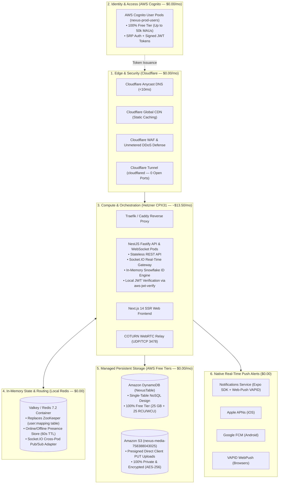

# Nexus — Implementation of the New Architecture
## The Definitive Guide: What We Are Doing, Why We Are Doing It, and How We Are Doing It

---

## 1. Executive Summary & Core Architectural Question

### Do We Need an SQL Database for Chat Servers?
**Short Answer:** **NO.** You do **NOT** need an SQL database for chat servers. In fact, traditional SQL databases (PostgreSQL, MySQL) are the **#1 bottleneck** that cause scaling crashes in real-time chat applications.

### Why SQL Fails for Chat Messages at Scale:
1. **Append-Only Write Heavy Workload:** Chat messages are pure time-series event streams. They arrive in unpredictable bursts.
2. **ACID Locking Overhead:** Relational SQL databases enforce strict ACID guarantees, table-level or row-level write locks, and B-Tree re-indexing on every single incoming message. At thousands of messages per second, SQL disks choke.
3. **The Sharding Nightmare:** As message history reaches tens of millions of rows, relational tables bloat. Querying chat history with `JOIN users ON ... JOIN channels ON ...` degrades from 5ms to 800ms+. Discord famously migrated from relational/document databases to wide-column NoSQL (Cassandra/ScyllaDB) for this exact reason.
4. **Chat Access Patterns are Key-Range Queries:** In a chat app, you only ever query messages by `conversationId` within a time range (`before: timestamp`, `limit: 50`). This is a pure partition key + sort key range query—the exact access pattern that **DynamoDB and ScyllaDB** execute in **under 2 milliseconds at infinite scale**.

---

### How Many Databases Do We Actually Need?
You need **EXACTLY TWO (2) DATABASES** in your architecture:

| Database | Technology | Type | Primary Role & What It Stores |
| :--- | :--- | :--- | :--- |
| **Database 1: In-Memory State Store** | **Valkey / Redis 7.2** | In-Memory Key-Value | **Real-Time State:** Socket-to-server connection mapping (`user:mapping`), online/offline user presence (`presence:<userId>` with 60s TTL), active rate limits, and WebSocket Pub/Sub broadcast coordination across pods. |
| **Database 2: Persistent Primary Database** | **Amazon DynamoDB (`NexusTable`)** | Distributed NoSQL Single-Table | **Permanent Data:** User profiles, conversation metadata, end-to-end encrypted message history, cryptographic key envelopes, and ephemeral ghost chat TTL timers. |

> 💡 **Why 2 is the Golden Number:**  
> * **Redis** handles sub-millisecond ephemeral state that changes every second.  
> * **DynamoDB** handles permanent data that must never be lost.  
> * Keeping them separate guarantees that a database write spike never slows down real-time chat delivery.

---

## 2. What We Are Doing: The New Architecture Blueprint

We are modernizing the Nexus cloud infrastructure by eliminating expensive AWS enterprise taxes (NAT Gateways, oversized EC2 instances) and legacy distributed bloat (Apache ZooKeeper), and replacing them with a **lean, ultra-high-performance hybrid stack**:



---

## 3. Why We Are Doing It: The Rationale Behind Every Decision

### 1. Stopping the $81+/Month AWS Billing Bleed Immediately
* **The Reality:** Our live account audit revealed that **two `m7i-flex.large` EC2 instances** were generating **~$140/month** in compute and public IPv4 charges, exceeding the account's $30 budget.
* **The Fix:** Migrating compute to a single **Hetzner CPX31 VPS** gives us **4 AMD EPYC vCPUs, 8 GB RAM, and 160 GB NVMe** for a flat **~$13.50/month**, while keeping DynamoDB, Cognito, and S3 on AWS where they cost **$0.00**.

### 2. Eliminating Apache ZooKeeper Bloat
* **The Problem:** ZooKeeper requires a dedicated Java Virtual Machine (JVM), consumes excessive RAM, suffers from GC pauses, and requires 3–5 quorum nodes.
* **The Fix:** We replace ZooKeeper with **Redis Hashes (`HSET user:mapping <userId> <serverId>`)** and **Kubernetes/Docker health checks**. Lookups happen in **0.1 milliseconds** with zero Java overhead.

### 3. Preserving Zero-Egress Media Upload Architecture
* **The Problem:** Uploading 50MB user videos through API servers consumes CPU, saturates network bandwidth, and inflates memory.
* **The Fix:** The backend generates an **Amazon S3 Presigned URL**. The browser PUTs binary data directly to S3, bypassing our application servers entirely.

### 4. Dropping Unneeded Services (Brevo & Custom Auth)
* We do not send transactional marketing emails, so **Brevo is eliminated** (zero unnecessary API keys).
* **AWS Cognito (`nexus-prod-users`)** is already configured, secure, and 100% Free Tier up to 50,000 users. Keeping it saves hundreds of lines of custom JWT authentication code.

---

## 4. How We Are Doing It: Step-by-Step Implementation Plan

### Phase 1: AWS Account Cost Lockdown
1. Stop the billing bleed on AWS:
   ```bash
   # Terminate the secondary m7i-flex.large instance (i-0402ca8f81451df17)
   aws ec2 terminate-instances --instance-ids i-0402ca8f81451df17
   ```
2. For the primary instance:
   * Either resize `i-00306e9ab7f8c7c15` to **`t3.micro`** (Free Tier) with a 2GB swapfile.
   * Or deploy directly to a **Hetzner CPX31 VPS** (~$13.50/mo flat).

### Phase 2: In-Memory State & Redis Setup
Deploy **Valkey 7.2 (or Redis 7.2-Alpine)** to replace ZooKeeper and handle real-time mapping:
```yaml
# In docker-compose.yml:
services:
  redis:
    image: redis:7.2-alpine
    container_name: nexus-redis
    restart: unless-stopped
    command: ["redis-server", "--appendonly", "yes", "--maxmemory", "512mb", "--maxmemory-policy", "allkeys-lru"]
    volumes:
      - redis-data:/data
    networks:
      - nexus-network
```

### Phase 3: Presence & Connection Mapping Logic
In [`server/src/modules/chat/chat.gateway.ts`](file:///c:/Users/aveec/Desktop/Nexus/server/src/modules/chat/chat.gateway.ts), implement the connection registry and presence lifecycle:
```typescript
// 1. On Socket Connect (Replaces ZooKeeper):
async handleConnection(client: Socket) {
  const userId = client.data.userId;
  if (!userId) return;

  // Map user to current server/socket in Redis
  await this.redis.hset('user:mapping', userId, client.id);
  // Set presence key with 60s expiration
  await this.redis.set(`presence:${userId}`, 'online', 'EX', 60);

  this.server.emit('presence:update', { userId, status: 'online' });
}

// 2. On Heartbeat:
@SubscribeMessage('presence:heartbeat')
async handleHeartbeat(@ConnectedSocket() client: Socket) {
  const userId = client.data.userId;
  if (userId) await this.redis.expire(`presence:${userId}`, 60);
}

// 3. On Socket Disconnect:
async handleDisconnect(client: Socket) {
  const userId = client.data.userId;
  if (!userId) return;

  await this.redis.hdel('user:mapping', userId);
  await this.redis.set(`presence:${userId}`, 'offline');
  this.server.emit('presence:update', { userId, status: 'offline', lastSeen: new Date().toISOString() });
}
```

### Phase 4: Cloudflare Edge & Zero-Port Tunnel Setup
1. Point your domain nameservers to Cloudflare (Free Anycast DNS).
2. Install the `cloudflared` daemon on your compute server:
   ```bash
   cloudflared tunnel create nexus-tunnel
   cloudflared tunnel route dns nexus-tunnel api.yourdomain.com
   cloudflared tunnel run nexus-tunnel
   ```
3. **Result:** Your compute server has **zero open public ports**. All incoming traffic is filtered through Cloudflare WAF and DDoS mitigation.

### Phase 5: Verification & Load Testing
Run the automated **k6 benchmark suite** to verify performance under load:
```powershell
& "scratch/k6/k6-v0.54.0-windows-amd64/k6.exe" run --vus 50 --duration 30s tests/load/k6-load-suite.js
```

---

## 5. Summary Matrix: The Complete Final Architecture

| Component | Technology | Hosted On | Monthly Cost |
| :--- | :--- | :--- | :--- |
| **Edge, DNS & WAF** | Cloudflare Anycast + Tunnels | Cloudflare Global Edge | **$0.00** |
| **User Authentication** | AWS Cognito (`nexus-prod-users`) | AWS Managed (`us-east-1`) | **$0.00 (Up to 50k MAUs)** |
| **NoSQL Database** | Amazon DynamoDB (`NexusTable`) | AWS Managed (`us-east-1`) | **$0.00 (25 GB Free)** |
| **Object Storage** | Amazon S3 (`nexus-media-758388043025`) | AWS Managed (`us-east-1`) | **$0.00 (Within 5 GB)** |
| **Compute Core** | Hetzner CPX31 (or AWS `t3.micro`) | Hetzner / AWS | **~$13.50 / mo** *(or $0 on AWS)* |
| **State & Presence** | Valkey / Redis 7.2 (No ZooKeeper!) | Docker Container | **$0.00** |
| **Push Notifications** | Expo SDK + VAPID Web-Push | Docker Background Worker | **$0.00** |
| **WebRTC Media Relay** | COTURN (Raw UDP/TCP 3478) | Docker Container | **$0.00** |
| **TOTAL MONTHLY BILL** | | | **~$13.50 / month total!** |
